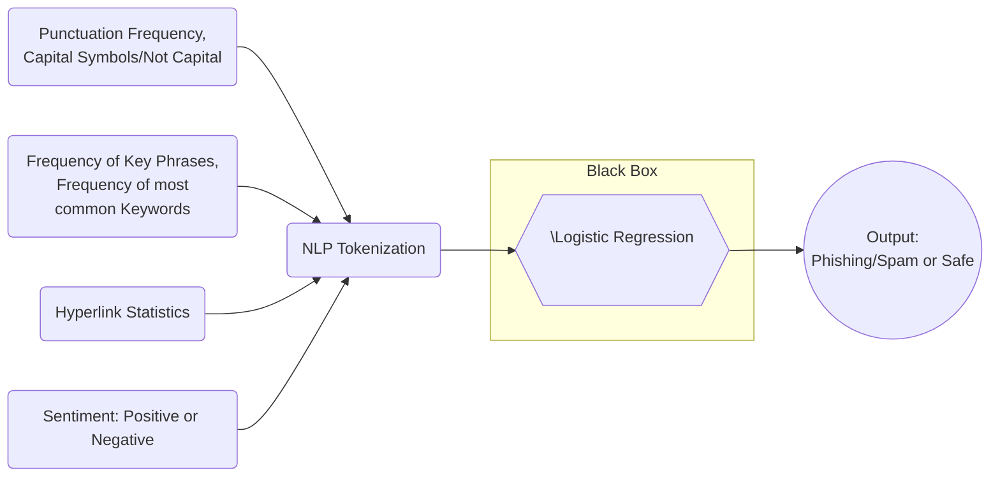

## Black Box Diagram

```mermaid
flowchart LR
    id1(Punctuation Frequency,\nCapital Symbols/Not Capital)
    id2(Frequency of Key Phrases,\n Frequency of most common Keywords)
    id3(Hyperlink Statistics)
    id4(Sentiment: Positive or Negative)
    id5(NLP Tokenization)
    subgraph sb [Black Box]
        direction LR
        id6{{\n\Logistic Regression\n\n\n}}
    end
    id1 --> id5
    id2 --> id5
    id3 --> id5
    id4 --> id5
    id5 --> id6
    id6 --> id8((Output:\n Phishing/Spam or Safe))
```
