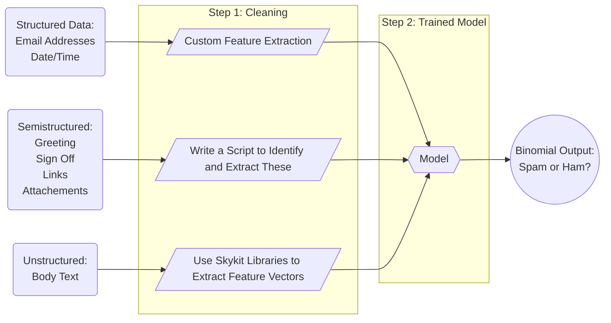

## Black Box Diagram

```mermaid
flowchart LR
    id1(Structured Data:\nEmail Addresses\nDate/Time)
    id2(Semistructured:\nGreeting\nSign Off\nLinks\nAttachements)
    id3(Unstructured:\nBody Text)
    subgraph sb [Step 1: Cleaning]
        direction LR
        id4[/Custom Feature Extraction/]
        id5[/Write a Script to Identify and Extract These/]
        id6[/Use Skykit Libraries to Extract Feature Vectors/]
    end
    id1 --> id4
    id2 --> id5
    id3 --> id6

    subgraph sb2 [Step 2: Trained Model]
    id7{{Model}}
    end

    id4 --> id7
    id5 --> id7
    id6--> id7

    id7 --> id8((Binomial Output:\nSpam or Ham?))
```